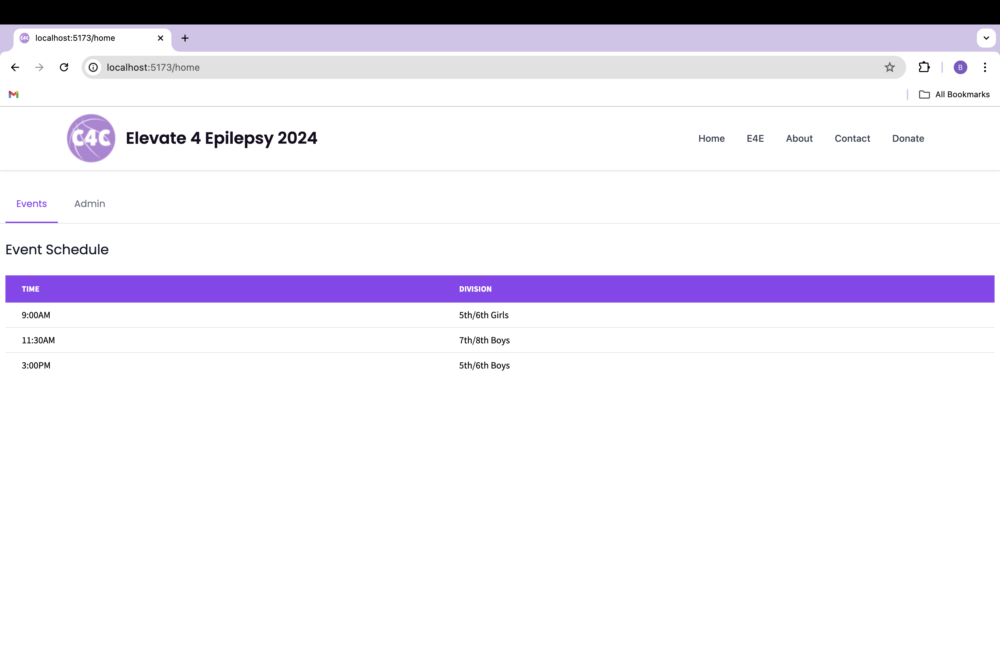
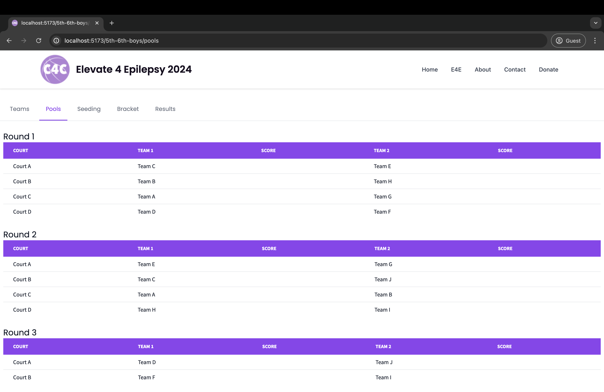
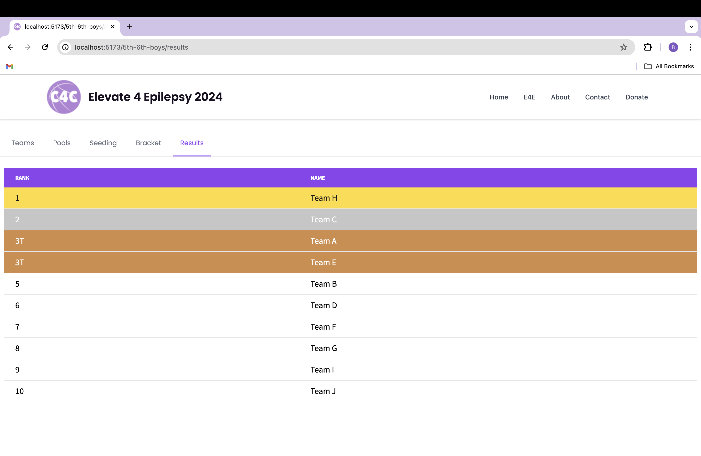

# Tournament-Scoring

## Project Overview
This proiect is designed to facilitate the organization and tracking of Elevate 4 Epilepsy basketball tournaments. Check it out at _.  

## Features
* Spectator view to check scores and standings for different divisions  
* Player view to check court assignments and opponents during the tournament, eliminating crowding near bulletin boards  
* Admin view to update scores and winners during the tournament  
* Automatic court assignments for pool and elimination games based on available courts to streamline efficiency of tournaments
* Logic to sort teams into initial pools where each team plays 2 games against random opponents  
* Logic to place teams into elmination bracket based on pool wins and points scored  

## About Crossovers for Cures
Crossovers for Cures raises money through basketball tournaments and events to combat some of the planet's most confusing diseases and disorders. Their annual tournament, Elevate 4 Epilepsy, takes place in Dublin, Ohio and has raised over $40,000 for epilepsy research through institutions such as NYU Langone. In 2024, C4C founder Dustin He asked me to build this scoring website to improve the efficiency of future basketball tournaments.


## Technology
Backend: Go  
Frontend: SvelteKit using Typescript and TailwindCSS  
Database: MongoDB  

## Screenshots
**The home page**


**Spectator view of the pool games**


**Admin view of the bracket**


**View of the final results page**


**Admin login**


## API
### GET Requests
**GET `/api/home` returns a list of all the divisions as well as information about the tournament.**  
Example Request: `GET http://localhost:8000/api/home`  

Example Response:
```
content-type: application/json
{
  "year": 2024,
  "events": [
    {
      "_id": "66988d7a98e653bd9fc78d84",
      "name": "3rd/4th Boys",
      "slug": "3rd-4th-boys",
      "time": "9:00AM",
    },
    {
      "_id": "66988d7a98e653bd9fc78d85",
      "name": "5th/6th Boys",
      "slug": "5th-6th-boys",
      "time": "11:30AM",
    },
    ...
  ]
}
```

**GET `/api/{event_slug}/teams` returns a list of teams for the division.**  
Example Request: `GET http://localhost:8000/api/3rd-4th-boys/teams`  

Example Response: 
```
content-type: application/json
{
  [
  {
    "_id": "66988da349c67a7b33acfef2",
    "name": "Team A",
    "event": "3rd-4th-boys"
  },
  {
    "_id": "66988da349c67a7b33acfef3",
    "name": "Team B",
    "event": "3rd-4th-boys"
  },
  ...
  ]
}
```

**GET `/api/{event_slug}/pools` returns a map of pool rounds and games for the division. If pools haven't started, it will return an error.**  
Example Request: `GET http://localhost:8000/api/3rd-4th-boys/pools`  

Example Response: 
```
content-type: application/json
{
  "1": [
    {
      "_id": "66988df949c67a7b33acfefa",
      "event": "3rd-4th-boys",
      "round": 1,
      "court": "A",
      "team1Id": "66988da349c67a7b33acfef2",
      "team2Id": "66988da349c67a7b33acfef4",
      "team1Name": "Team A",
      "team2Name": "Team C"
    },
    ...
  ],
  "2": [
    {
      "_id": "66988df949c67a7b33acfefe",
      "event": "3rd-4th-boys",
      "round": 2,
      "court": "A",
      "team1Id": "66988da349c67a7b33acfef4",
      "team2Id": "66988da349c67a7b33acfef9",
      "team1Name": "Team C",
      "team2Name": "Team H"
    },
    ...
  ]
}
```

**GET `/api/{event_slug}/seeding` returns an ordered list of all the seeded teams for the division. If pools haven't finished, it will return an error.**  
Example Request: `GET http://localhost:8000/api/3rd-4th-boys/seeding`  

Example Response: 
```
content-type: application/json
{
  "1": [
    {
      "_id": "66988df949c67a7b33acfefa",
      "event": "3rd-4th-boys",
      "round": 1,
      "court": "A",
      "team1Id": "66988da349c67a7b33acfef2",
      "team2Id": "66988da349c67a7b33acfef4",
      "team1Name": "Team A",
      "team2Name": "Team C"
    },
    ...
  ],
  "2": [
    {
      "_id": "66988df949c67a7b33acfefe",
      "event": "3rd-4th-boys",
      "round": 2,
      "court": "A",
      "team1Id": "66988da349c67a7b33acfef4",
      "team2Id": "66988da349c67a7b33acfef9",
      "team1Name": "Team C",
      "team2Name": "Team H"
    },
    ...
  ]
}
```

**GET `/api/{event_slug}/bracket` returns the elimination bracket for the division as a binary tree. It also contains information about the available courts. If elimination hasn't started yet, it will return an error.**  
Example Request: `GET http://localhost:8000/api/3rd-4th-boys/bracket`  

Example Response: 
```
content-type: application/json
{
  "event": "3rd-4th-boys",
  "rounds": 4,
  "courts": ["A", "B"],
  "root": {
    "teamId": "000000000000000000000000",
    "left": {
      "team": "Team A",
      "teamId": "669893052342d778f9b4358a",
      "seeding": 1,
    },
    "right": {
      "team": "Team B",
      "teamId": "669893052342d778f9b4358b",
      "seeding": 2,
    },
    "court": "A" 
  }
}
```

**GET `/api/{event_slug}/bracket` returns the elimination bracket as a binary tree. If elimination hasn't started yet, it will return an error.**  
Example Request: `GET http://localhost:8000/api/3rd-4th-boys/bracket`  

Example Response: 
```
content-type: application/json
{
  "event": "3rd-4th-boys",
  "rounds": 4,
  "courts": ["A", "B"],
  "root": {
    "teamId": "000000000000000000000000",
    "left": {
      "team": "Team A",
      "teamId": "669893052342d778f9b4358a",
      "seeding": 1,
    },
    "right": {
      "team": "Team B",
      "teamId": "669893052342d778f9b4358b",
      "seeding": 2,
    },
    "court": "A" 
  }
}
```

**GET `/api/{event_slug}/results` returns the final results as a list. If elimination hasn't finished yet, it will return an error.**  
Example Request: `GET http://localhost:8000/api/3rd-4th-boys/results`  

Example Response: 
```
content-type: application/json
[
  {
    "_id": "669f12060cabf77119d9cc3f",
    "name": "Team D",
    "event": "5th-6th-boys",
    "poolsWon": 2,
    "totalPoints": 153,
    "seeding": 1,
    "rank": 1
  },
  {
    "_id": "669f12060cabf77119d9cc42",
    "name": "Team G",
    "event": "5th-6th-boys",
    "poolsWon": 2,
    "totalPoints": 122,
    "seeding": 3,
    "rank": 2
  },
  ...
]
```

### POST Requests
**POST `/api/{event_slug}/start-pools` starts the pool round for the division.**  
Example Request: `POST /api/3rd-4th-boys/start-pools`  

Example Response:
```
content-type: application/json
{
  "response": "Pools successfuly started"
}
```

**POST `/api/{event_slug}/start-elimination` starts the elimination round for the division.**  
Example Request: `POST /api/3rd-4th-boys/start-elimination`  

Example Response:
```
content-type: application/json
{
  "response": "Elimination successfuly started"
}
```

**POST `/api/update-pool` updates a pool game with both team's scores.**  
Example Request: `POST /api/update-pool`  
```
content-type: application/json
{
		"gameId": "66a04aa146184fb4574e6d4c",
    "team1Score": "17",
    "team2Score": "24"
}
```
Example Response:
```
content-type: application/json
{
  "response": "Game successfuly updated"
}
```

**POST `/api/update-elimination` advances a team in the elimination bracket it belongs to.**  
Example Request: `POST /api/update-elimination`  
```
content-type: application/json
{
    "teamId": "669c23fb70b0b1c2cb2e8317"
}
```

Example Response:
content-type: application/json
```
{
  "response": "Team successfuly updated"
}
```

## Contributing
Brian Zhou, Dustin He  

**If you've made it this far, please consider donating at https://www.crossoversforcures.org/donate/!**  
